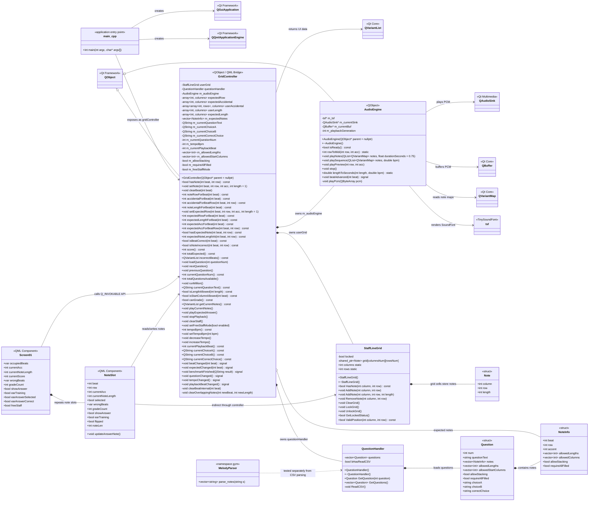

```mermaid
classDiagram
    direction LR

    class QObject {
        <<Qt Framework>>
    }

    class QGuiApplication {
        <<Qt Framework>>
    }

    class QQmlApplicationEngine {
        <<Qt Framework>>
    }

    class QAudioSink {
        <<Qt Multimedia>>
    }

    class QBuffer {
        <<Qt Core>>
    }

    class QVariantMap {
        <<Qt Core>>
    }

    class QVariantList {
        <<Qt Core>>
    }

    class tsf {
        <<TinySoundFont>>
    }

    class AudioEngine {
        <<QObject>>
        -tsf* m_tsf
        -QAudioSink* m_currentSink
        -QBuffer* m_currentBuf
        -int m_playbackGeneration
        +AudioEngine(QObject* parent = nullptr)
        +~AudioEngine()
        +bool isReady() const
        +int rowToMidi(int row, int acc) static
        +void playNotes(QList~QVariantMap~ notes, float durationSeconds = 0.75)
        +void playSequence(QList~QVariantMap~ notes, double bpm)
        +void playPreview(int row, int acc)
        +void stop()
        +double lengthToSeconds(int length, double bpm) static
        +void beatAdvanced(int beat) signal
        -void playPcm(QByteArray pcm)
    }

    class GridController {
        <<QObject / QML Bridge>>
        -StaffLineGrid userGrid
        -QuestionHandler questionHandler
        -AudioEngine m_audioEngine
        -array~int, columns~ expectedRow
        -array~int, columns~ expectedAccidental
        -array~array~int, rows~, columns~ userAccidental
        -array~int, columns~ userLength
        -array~int, columns~ expectedLength
        -vector~NoteInfo~ m_expectedNotes
        -QString m_currentQuestionText
        -QString m_currentChoiceA
        -QString m_currentChoiceB
        -QString m_currentCorrectChoice
        -int m_currentQuestionNum
        -int m_tempoBpm
        -int m_currentPlaybackBeat
        -vector~int~ m_allowedLengths
        -vector~int~ m_allowedStartColumns
        -bool m_allowStacking
        -bool m_requireAllFilled
        -bool m_freeStaffMode
        +GridController(QObject* parent = nullptr)
        +bool hasNote(int beat, int row) const
        +void setNote(int beat, int row, int acc, int length = 1)
        +void clearBeat(int beat)
        +int noteRowForBeat(int beat) const
        +int accidentalForBeat(int beat) const
        +int accidentalForBeatRow(int beat, int row) const
        +int noteLengthForBeat(int beat) const
        +void setExpectedRow(int beat, int row, int acc, int length = 1)
        +int expectedRowForBeat(int beat) const
        +int expectedLengthForBeat(int beat) const
        +int expectedAccForBeat(int beat) const
        +int expectedAccForBeatRow(int beat, int row) const
        +bool hasExpectedNote(int beat, int row) const
        +int expectedNoteLengthAt(int beat, int row) const
        +bool isBeatCorrect(int beat) const
        +bool isNoteIncorrect(int beat, int row) const
        +int score() const
        +int totalExpected() const
        +QVariantList incorrectBeats() const
        +void loadQuestion(int questionNum)
        +void nextQuestion()
        +void previousQuestion()
        +int currentQuestionNum() const
        +int totalQuestionsAvailable()
        +void runMillion()
        +QString currentQuestionText() const
        +bool isLengthAllowed(int length) const
        +bool isStartColumnAllowed(int beat) const
        +bool canGrade() const
        +QVariantList getCurrentNotes() const
        +void playCurrentNotes()
        +void playExpectedAnswer()
        +void stopPlayback()
        +void clearStaff()
        +void setFreeStaffMode(bool enabled)
        +int tempoBpm() const
        +void setTempoBpm(int bpm)
        +void decreaseTempo()
        +void increaseTempo()
        +int currentPlaybackBeat() const
        +QString currentChoiceA() const
        +QString currentChoiceB() const
        +QString currentCorrectChoice() const
        +void beatChanged(int beat) signal
        +void expectedChanged(int beat) signal
        +void benchmarkFinished(QString result) signal
        +void questionChanged() signal
        +void tempoChanged() signal
        +void playbackBeatChanged() signal
        -void clearBeatInternal(int beat)
        -void clearOverlappingNotes(int newBeat, int newLength)
    }

    class StaffLineGrid {
        -bool locked
        -shared_ptr~Note~ grid[columnsNum][rowsNum]
        +int columns static
        +int rows static
        +StaffLineGrid()
        +~StaffLineGrid()
        +bool HasNote(int column, int row) const
        +void AddNote(int column, int row)
        +void AddNote(int column, int row, int length)
        +void RemoveNote(int column, int row)
        +void ClearGrid()
        +void LockGrid()
        +void UnlockGrid()
        +bool GetLockedStatus()
        +bool ValidPosition(int column, int row) const
    }

    class Note {
        <<struct>>
        +int column
        +int row
        +int length
    }

    class QuestionHandler {
        -vector~Question~ questions
        -bool bHasReadCSV
        +QuestionHandler()
        +~QuestionHandler()
        +Question GetQuestion(int question)
        +vector~Question~ GetQuestions()
        -void ReadCSV()
    }

    class Question {
        <<struct>>
        +int num
        +string questionText
        +vector~NoteInfo~ notes
        +vector~int~ allowedLengths
        +vector~int~ allowedStartColumns
        +bool allowStacking
        +bool requireAllFilled
        +string choiceA
        +string choiceB
        +string correctChoice
    }

    class NoteInfo {
        <<struct>>
        +int beat
        +int row
        +int accent
        +vector~int~ allowedLengths
        +vector~int~ allowedColumns
        +bool allowStacking
        +bool requireAllFilled
    }

    class MelodyParser {
        <<namespace gym>>
        +vector~string~ parse_notes(string s)
    }

    class Screen01 {
        <<QML Component>>
        +var occupiedBeats
        +int currentAcc
        +int currentNoteLength
        +int currentScore
        +var wrongBeats
        +int gradeCount
        +bool showAnswer
        +bool earTraining
        +bool earAnswerSelected
        +bool earAnswerCorrect
        +bool freeStaff
    }

    class NoteSlot {
        <<QML Component>>
        +int beat
        +int row
        +int currentAcc
        +int currentNoteLength
        +bool selected
        +var wrongBeats
        +int gradeCount
        +bool showAnswer
        +bool earTraining
        +bool flipped
        +int noteLen
        +void updateAnswerNote()
    }

    class main_cpp {
        <<application entry point>>
        +int main(int argc, char* argv[])
    }

    QObject <|-- AudioEngine
    QObject <|-- GridController

    GridController *-- StaffLineGrid : owns userGrid
    GridController *-- QuestionHandler : owns questionHandler
    GridController *-- AudioEngine : owns m_audioEngine
    GridController o-- NoteInfo : expected notes

    StaffLineGrid *-- Note : grid cells store notes
    QuestionHandler *-- Question : loads questions
    Question *-- NoteInfo : contains notes

    AudioEngine --> tsf : renders SoundFont
    AudioEngine --> QAudioSink : plays PCM
    AudioEngine --> QBuffer : buffers PCM
    AudioEngine --> QVariantMap : reads note maps

    main_cpp --> QGuiApplication : creates
    main_cpp --> QQmlApplicationEngine : creates
    main_cpp --> GridController : exposes as gridController

    Screen01 --> GridController : calls Q_INVOKABLE API
    Screen01 *-- NoteSlot : repeats note slots
    NoteSlot --> GridController : reads/writes notes
    NoteSlot --> StaffLineGrid : indirect through controller

    GridController --> QVariantList : returns UI data
    MelodyParser ..> QuestionHandler : tested separately from CSV parsing
```
